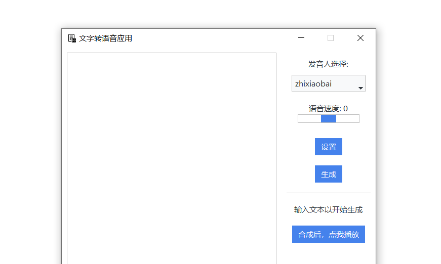

## 简介

一个极其简单的调用阿里云接口，文本生成语音的GUI工具

特点

- 简单：主打一个简单，核心代码不到两百行，修改自定义方便，诞生的目的是给自家人用，配置好之后只需要点点点

- 安全：使用自己的阿里云接口，没有第三方能看到你的内容

功能

- 设置语速
- 合成语音
- 合成之后点击就能打开，不用打开文件夹翻找

后续任务

- 设置发音人
- 设置语调
- 设置自定义路径

## 使用方法

### 编译：

1. 自己编译

   ```shell
   # 克隆项目，使用git或者直接下载包
   git clone https://github.com/Sisyphean-a/AliyunSpeakEasy.git
   
   # 安装环境，推荐pipenv
   # 如果不想使用3.11，就把Pipfile以及Pipfile.lock删除再进行后续操作
   winget install Python.Python.3.11
   pip install pipenv
   
   # 创建虚拟环境
   cd .\AliyunSpeakEasy
   pipenv install

   # 进入虚拟环境
   pipenv shell
   
   # 打包成单文件
   pyinstaller -F -w main.py
   ```

2. 使用我打包的文件

### 获取阿里云API

进入阿里云，注册访问控制和语音合成，获取三大项

1. 访问控制：https://ram.console.aliyun.com/overview

   这里生成一个用户，赋予权限，获取**AccessKey ID**与**AccessKey Secret**

2. 职能语音交互：https://nls-portal.console.aliyun.com/overview

   这里生成一个项目，获取**appkey**

### 开始使用

点击设置，填入三大项，路径不用填，我还没有做这一个部分。。。

保存，然后就可以使用了，生成之后不用找文件夹，点击下面的按钮就能直接打开